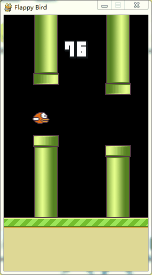

# DQN_FlappyBird

There is a Pre-Trained model included in the project, which cost about 8 hours with GPU. The bird in fact flys well with 1,000,000 times but in this model 2,270,000 
### train
To train a model, run

`deep_q_network.py`

### test
To load a model, set [FINAL_EPSILON](https://github.com/zcoo/DQN_FlappyBird/blob/master/game/deep_q_network.py#L20) to 0.0001 and [checkpoint](https://github.com/zcoo/DQN_FlappyBird/blob/master/game/saved_model/checkpoint#1) to the model you trained
